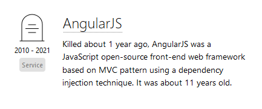

class: center, middle

# Migrez vos apps AngularJS vers React
# au fil de l'eau !

---

# Agenda

1. Pourquoi migrer ?
2. Comment migrer ?
3. react2angular à la rescousse

---

name: why

# 1. Pourquoi migrer ?

.grid[
.left[
]
.right[
]]

[Note de fin support AngularJS](https://blog.angular.io/discontinued-long-term-support-for-angularjs-cc066b82e65a)

---

name: why-react

# 1. Pourquoi migrer... vers React ?

- Recommendation de la `COP Front` (jusqu'à avis contraire)
- Stack toujours maintenue et qui continue d'évoluer
- Bonne maitrise de la stack au sein d'AXA et sur le marché
- Librairies à disposition en interne pour faciliter développement et maintenance (`toolkits`, ...)

.center[]